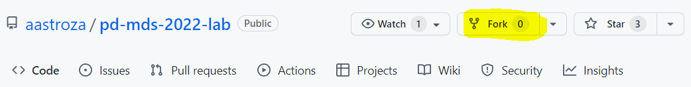
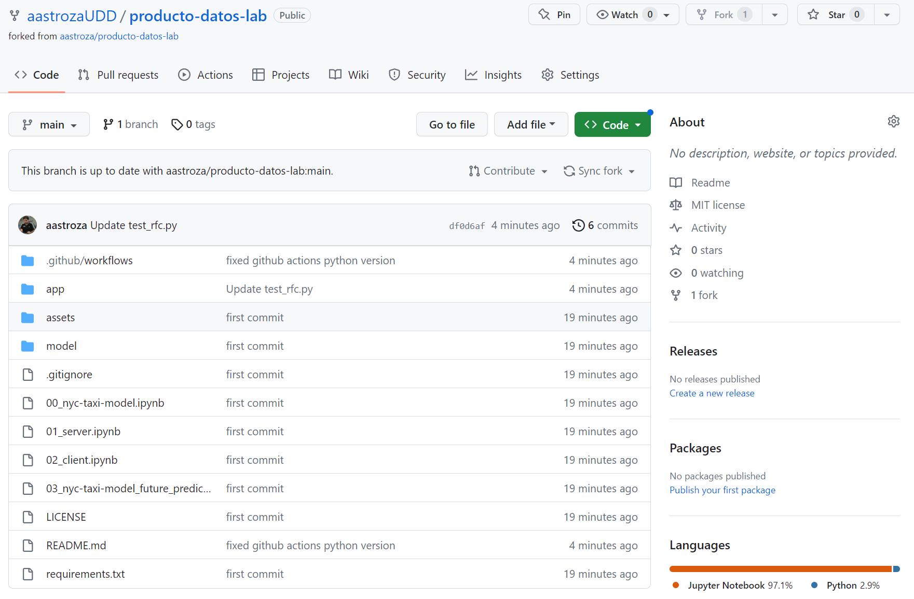
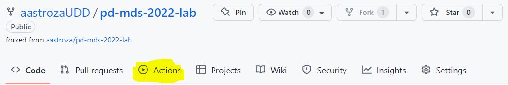
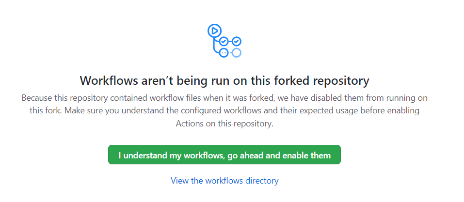

# Laboratorio - Implementando un modelo de Machine Learning

**Este Laboratorio está inspirado en la unidad 1 del curso [Introduction to Machine Learning in Production (DeepLearning.AI)](https://www.coursera.org/learn/introduction-to-machine-learning-in-production/home/welcome). También se apoya en código para generar el modelo disponible en [este repositorio de Shreya Shankar](https://github.com/shreyashankar/debugging-ml-talk) e implementar un flujo de trabajo usando Github Actions de la [Unidad 4 del curso mencionado anteriormente](https://github.com/jesussantana/DeepLearning.AI-Introduction-to-Machine-Learning-in-Production).**

Para comenzar deben haber bajado todos los archivos a una carpeta y en el terminal de Anaconda llegar a ese directorio.

```
.
└── producto-datos-lab (este directorio)
    ├── model (acá irán nuestros modelos)
    ├── 00_nyc-taxi-model.ipynb
    ├── 01_server.ipynb
    ├── 02_client.ipynb
    └── requirements.txt (dependencias de Python)
```
 
 
## Pasos previos usando Conda
 
### Prerequisito: Tener [conda](https://docs.conda.io/en/latest/) instalado en tu computador.
 
Vamos a usar Conda para construir un entorno virtual nuevo.
 
### 1. Creando el entorno virtual (Virtual Environment)
 
Asumiremos que tenemos instalado conda. El primer paso es crear un nuevo enviroment para desarrollar. Para crear uno usando Python 3.8 debemos ejecutar el siguiente comando:
 
```bash
conda create --name producto-datos-lab python=3.9.12
```
 
Luego debemos activarlo usando el comando:
 
```bash
conda activate producto-datos-lab
```
 
Todo el trabajo que realicemos con este código será en este entorno. Así que al trabajarcon estos archivos siempre tiene que estar activo el ambiente pd-mds-2022-lab.
 
### 2. Instalando las dependencias usando PIP 
 
Antes de seguir, verifica que en el terminal de Anaconda estés dentro del directorio `producto-datos-lab`, el cual incluye el archivo `requirements.txt`. Este archivo enlista todas las dependencias necesarias y podemos usarlo para instalarlas todas:
 
```bash
pip install -r requirements.txt
```
 
Este comando puede demorar un rato dependiendo de la velocidad del computador y la de la conexión a Internet. Una vez que termine ya está listo todo para comenzar una sesión de Jupyter Lab o Notebook.

Luego debemos enlazar el kernel de jupyter lab a nuestro nuevo enviroment:

```bash
python -m ipykernel install --user --name producto-datos-lab
```

 
### 3. Iniciando Jupyter Lab
 
Jupyter lab debería haber quedado instalado en el paso anterior, así que basta con escribir:

```bash
jupyter lab
```

### 4. Generando modelo de ML

El notebook que genera el modelo se puede ejecutar en su totalidad desde [Google Colab](https://drive.google.com/file/d/19R8yRdgGOIuGCBmHZQibADRbz_JRV6tt/view?usp=sharing).


## Agregando pipelines de CI/CD usando GitHub Actions

En este laboratorio también usaremos [GitHub Actions](https://github.com/features/actions) para automatizar flujos de trabajo de Machine Learning. Además haremos un test unitario simple usando [pytest](https://docs.pytest.org/en/6.2.x/) para evaluar cambios en el código antes de publicar a producción.

Para esta parte debemos hacer un [fork](https://docs.github.com/en/get-started/quickstart/fork-a-repo) de este repositorio para que podamos correr las GH actions en nuestra propia copia del repositorio.


### ¿Qué es GH Actions?

Es una herramienta sensacional que permite definir flujos de trabajo automáticos para eventos específicos dentro de un repositorio de GitHub. 

Vamos a preparar una acción que corra test unitarios definidos en el código cada vez que mandemos cambios al repositorio remoto.


### Fork el repositorio público

Hacer fork a un repositorio es simplemente crear una versión propia de este. Se usa bastante en el desarrollo de software Open Source para organizar una forma de trabajar colaborativamente. En vez de usar el mismo repositorio público (en el que probablemente no se tenga acceso de escritura) se puede trabajar en el fork y mandar Pull Requests desde ahí. Para hacer un fork de este repo sólo se debe clickear en el botón `Fork` en la esquina superior derecha:



Una vez que el proceso de fork haya terminado, deberíamos tener una copia del repositorio pero registrada bajo nuestro propio nombre de usuario:



Ahora necesitamos clonarlo a nuestra máquina local. Se puede hacer mediante [GitHub Desktop](https://desktop.github.com/) o usando este comando (ojo que hay que reemplazar el username por el propio):

```bash
git clone https://github.com/your-username/producto-datos-lab.git
```

Ahora hay que habilitar las Actions en el fork. Se puede hacer haciendo click en el botón Actions:



Y luego haciendo click en el botón verde:



### Navegando en el fork

Ahora revisemos lo que hay en el repositorio.

Notemos que hay un directorio oculto en la raíz del repositorio que se llama `.github`. Dentro hay otro directorio llamado `workflows`, aquí se ponen todos los archivos necesarios para configurar las Actions. Estos archivos deben estar en formato `YAML`. En este caso debemos encontrarnos con uno llamado `producto-datos-lab.yml` que será responsable de configurar la acción que deseamos corra el test unitario. El contenido de este archivo es el siguiente:

```yml
# Run unit tests for your Python application

name: PD-MDS-Lab

# Controls when the action will run. 
on:
  # Triggers the workflow on push request events only when there are changes in the desired path
  push:
    paths:
      - 'app/**'

# A workflow run is made up of one or more jobs that can run sequentially or in parallel
jobs:
  # This workflow contains a single job called "test"
  test:
    # The type of runner that the job will run on
    runs-on: ubuntu-latest
    defaults:
      run:
        # Use bash as the shell
        shell: bash


    # Steps represent a sequence of tasks that will be executed as part of the job
    steps:
      -
        name: Checkout
        uses: actions/checkout@v2
      - 
        name: Set up Python
        uses: actions/setup-python@v2
        with:
          python-version: '3.8.2'
      - 
        name: Install dependencies
        run: |
          python -m pip install --upgrade pip
          pip install -r requirements.txt
      -
        name: Test with pytest
        run: |
          cd app/
          pytest
```

Veamos cada parte de este archivo:

```yml
name: PD-MDS-Lab
on:
  push:
    paths:
      - 'app/**'
```

Acá se define un nombre para la Action para poder diferenciarla de otras. Además se específica que la disparará, en este caso será por cualquier **push** que cambie algún archivo dentro del directorio `app/`.

```yml
jobs:
  test:
    runs-on: ubuntu-latest
    defaults:
      run:
        shell: bash
```

En la siguiente parte se define que trabajos o tareas (`jobs`) deben ejecutarse cuando se dispare esta Action. En este caso es solo un `job`, que se llama `test` y que se ejecutará en un ambiente con el último release de Ubuntu. Además se puede definir algún comportamiento por defecto para este `job`, como el shell (intérprete de comandos) deseado, en este caso `bash`.

```yml
    steps:
      -
        name: Checkout
        uses: actions/checkout@v2
      - 
        name: Set up Python
        uses: actions/setup-python@v2
        with:
          python-version: '3.8.2'
      - 
        name: Install dependencies
        run: |
          python -m pip install --upgrade pip
          pip install -r requirements.txt
      -
        name: Test with pytest
        run: |
          cd app/
          pytest
```

Finalmente hay que definir pasos o etapas (`steps`) para que está Action se complete. Son secuencias de comandos que logren alcanzar la funcionalidad deseada. `steps` tiene varios parámetros asociados como:

- `name`: el nombre del paso.

- `uses`: se puede especificar una `Action` que ya exista como un paso. 

- `run`: en vez de utilizar una Action que ya exista también puede que se desee correr un comando. Dado que acá usamos `bash` dentro de una máquina virtual Linux, estos comandos deben tener la sintaxis adecuada.

- `with`: se usa si es que se necesita especificar parámetros adicionales.


Para entender cada paso:

- El primer paso usa la Action `actions/checkout@v2`. Esto suualmente se incluye en todas las Action ya que permite a GitHub tener aceso o hacer check-put del repo.

- Ahora que se hizo un check-out del repo, se debe configurar un ambiente capaz de correr código en Python. Para cumplir esto usamos la Action  `actions/setup-python@v2` especificando la versión de Python que necesitamos.

- Teniendo ya el ambiente Python necesitamos instalar las depencias. Podemos hacerlo haciendo upgrade a `pip` y usarlo para instalar las depencias listadas en el archivo `requirements.txt`.

- Finalmente podemos correr la prueba unitaria usando el comando `pytest`. Notemos que primero debemos hacer un `cd` para entrar al directorio `app`.

Ahora que entendemos de mejor forma lo que hace un GH Action, podemos ponerlas a prueba.


### Probando el pipeline CI/CD

Dentro del directorio `app` hay una copia del programa servidor que entrega predicciones sobre los viajes en taxi. El código se encarga de cargar el clasificador en el estado global incluso antes de comenzar el server. Esto es porque queremos hacer test unitarios antes de comenzar siquiera el servicio.

#### Test unitario con pytest

Para realizar el test unitario usaremos la biblioteca `pytest`. Para usarla debemos poner nuestros test en scripts de Python donde el nombre de archivo empiece por el prefijo `test_`, en este caso se llama `test_rfc.py` ya que probaremos el desempeño del clasificador Random Forest. 

Miremos el contenido de este archivo:

```python
import pandas as pd
from main import rfc
from sklearn.metrics import f1_score

def test_accuracy():

    # Load test data
    taxi_test = pd.read_csv('./data/yellow_tripdata_2020-03_test.csv')

    numeric_feat = [
    "pickup_weekday",
    "pickup_hour",
    'work_hours',
    "pickup_minute",
    "passenger_count",
    'trip_distance',
    'trip_time',
    'trip_speed'
    ]
    categorical_feat = [
        "PULocationID",
        "DOLocationID",
        "RatecodeID",
    ]

    features = numeric_feat + categorical_feat
    target_col = "high_tip"

    # Predict test examples
    preds_test = rfc.predict_proba(taxi_test[features])
    preds_test_labels = [p[1] for p in preds_test.round()]

    # Compute f1-score of classifier
    f1 = f1_score(taxi_test[target_col], preds_test_labels)


    # f1-score should be over 0.7
    assert f1 > 0.7
```

Hay solo una prueba unitaria definida en el método `test_accuracy`. Esta función carga los datos de test guardados en el archivo `data/yellow_tripdata_2020-03_test.csv` correspondiente a la muestra de viajes de marzo de 2020. Luego se usan estos datos para calcular el f1-score sobre los datos de prueba. 

Si el f1-score es mayor a 0.7 la prueba se pasa exitosamente. De otra forma, falla.

### Corriendo la GitHub Action

Para correr el test unitario usando el pipeline CI/CD necesitamos hacer cambios en el repositorio remoto, específicamente en el directorio `app/`. Para hacer esto, **agreguemos un comentario dentro del archivo `main.py` y guardemos los cambios**.

Ahora debemos usar git para hacer pull de los cambios hace la versión remota de nuestro fork.

- Primero se verifica si hubo cambios usando el comando `git status`. Deberíamos ver el archivo `main.py` en la lista.

- Ahora hay que hacer stage de todos los cambios usando `git add --all`.
- Crear un commit con el comando `git commit -m "Testing the CI/CD pipeline"`. 
- Finalmente hacer push de los cambios usando `git push origin main`.

Con este push el pipeline CI/CD debe haber sido disparado. Para verlo en acción debemos visitar el repo fork usando un navegador y hacer click en el botón  `Actions`.


Ahora podemos ver todo lo que ocurre mientras corre el flujo de trabajo que configuramos. Si luego de unos segundos volvemos a hacer click en el botón `Actions` podemos ver la lista de run acompañado con un íncono verde que muestra que todos los test fueron superados.


¡Acabamos de ejecutar nuetro primer flujo de trabajo de CI/CD!

### Corriendo el pipeline otra vez

#### Cambiando el código

Supongamos que el equipo de Data Science solicita estar siempre monitoreando el desempeño del clasificador usando datos de los días recientes. Simulemos ese comportamiento cambiando el archivo de los datos de test en el directorio `data/` modificando el script `test_rfc.py`. Hagamos el siguiente cambio para probar con datos de mayo de 2020:

```python
# Load test data
    taxi_test = pd.read_csv('./data/yellow_tripdata_2020-03_test.csv')
```

Y lo modificamos a esto:

```python
# Load test data
    taxi_test = pd.read_csv('./data/yellow_tripdata_2020-05_test.csv')
```

Una vez que guardamos los cambios, usamos git para hacer push con los mismos comandos de antes:

- `git add --all`
- `git commit -m "Adding new test data"`
- `git push origin main`

¿Qué es lo que ocurre? ¿Cómo podríamos solucionarlo?

